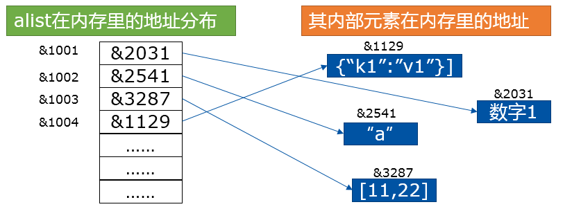

#数据类型
##数字类型
1. 整数(Int)
2. 小数（float）
3. 复数( (complex))

数字类型转换：

有时候，我们需要对数字的类型进行转换。Python为我们提供了方便的内置的数据类型转换函数。

int(x)： 将x转换为一个整数。如果x是个浮点数，则截取小数部分。

float(x) ：将x转换到一个浮点数。

complex(x) ：将x转换到一个复数，实数部分为 x，虚数部分为 0。

complex(x, y)： 将 x 和 y 转换到一个复数，实数部分为 x，虚数部分为 y。

数学计算

对于数学计算，除了前面提到过的简单的加减乘除等等，更多的科学计算需要导入math这个库，它包含了绝大多数我们可能需要的科学计算函数，如下表。

函数	返回值 ( 描述 )
abs(x)	返回数字的绝对值，如abs(-10) 返回 10
ceil(x)	返回数字的上入整数，如math.ceil(4.1) 返回 5
exp(x)	返回e的x次幂(ex),如math.exp(1) 返回2.718281828459045
fabs(x)	返回数字的绝对值，如math.fabs(-10) 返回10.0
floor(x)	返回数字的下舍整数，如math.floor(4.9)返回 4
log(x)	如math.log(math.e)返回1.0,math.log(100,10)返回2.0
log10(x)	返回以10为基数的x的对数，如math.log10(100)返回 2.0
max(x1, x2,...)	返回给定参数的最大值，参数可以为序列。
min(x1, x2,...)	返回给定参数的最小值，参数可以为序列。
modf(x)	返回x的整数部分与小数部分，两部分的数值符号与x相同，整数部分以浮点型表示。
pow(x, y)	x**y 运算后的值。
round(x [,n])	返回浮点数x的四舍五入值，如给出n值，则代表舍入到小数点后的位数。
sqrt(x)	返回数字x的平方根
acos(x)	返回x的反余弦弧度值。
asin(x)	返回x的反正弦弧度值。
atan(x)	返回x的反正切弧度值。
atan2(y, x)	返回给定的 X 及 Y 坐标值的反正切值。
cos(x)	返回x的弧度的余弦值。
hypot(x, y)	返回欧几里德范数 sqrt(xx + yy)
sin(x)	返回的x弧度的正弦值。
tan(x)	返回x弧度的正切值。
degrees(x)	将弧度转换为角度,如degrees(math.pi/2) ， 返回90.0
radians(x)	将角度转换为弧度
以及两个数学常量：

常量	描述
pi	数学常量 pi（圆周率，一般以π来表示）
e	数学常量 e，e即自然常数（自然常数）。

##布尔类型
但在Python语言中，布尔类型只有两个值，True与False。请注意，是英文单词的对与错，并且首字母要大写，不能其它花式变型。
Python内置的bool()函数可以用来测试一个表达式的布尔值结果。

0、0.0、-0.0、空字符串、空列表、空元组、空字典，这些都被判定为False。而-1、"False"也被判断为True。

比较运算，四则运算都没有问题。并且在做四则运算的时候，明显把True看做1，False看做0。

```angular2
>>> True > False
True
>>> True < False
False
>>> True >=False
True
>>> True -1
0
>>> True + 1
2
>>> True *3
3
>>> False -1
-1
```

##空值：None
空值不是布尔类型，严格的来说放在这里是不合适的，只不过和布尔关系比较紧密。

空值是Python里一个特殊的值，用None表示（首字母大写）。None不能理解为0，因为0是整数类型，而None是一个特殊的值。None也不是布尔类型，而是NoneType。

```angular2
>>> bool(None)
False
>>> type(None)
<class 'NoneType'>
```


##列表
列表是Python中最基本也是最常用的数据结构之一。列表中的每个元素都被分配一个数字作为索引，用来表示该元素在列表内所排在的位置。第一个元素的索引是0，第二个索引是1，依此类推。

Python的列表是一个有序可重复的元素集合，可嵌套、迭代、修改、分片、追加、删除，成员判断。

从数据结构角度看，Python的列表是一个可变长度的顺序存储结构，每一个位置存放的都是对象的引用。

比如，对于这个列表 alist = [1, “a”, [11,22], {“k1”:”v1”}]，其在内存内的存储方式是这样的：



1. 创建方式
创建一个列表，只要把逗号分隔的不同的数据项使用方括号括起来即可。列表内的元素，可以是其它任意类型的数据，可多层嵌套列表，元素个数无限制。
